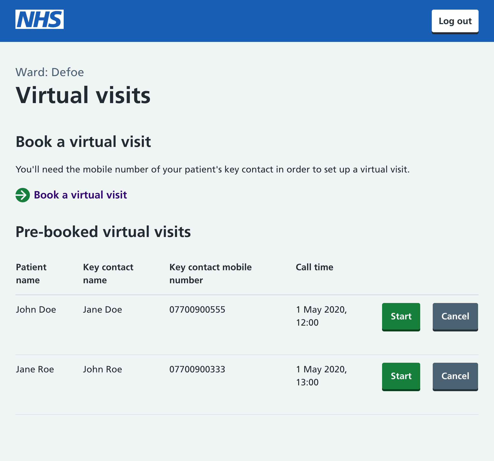
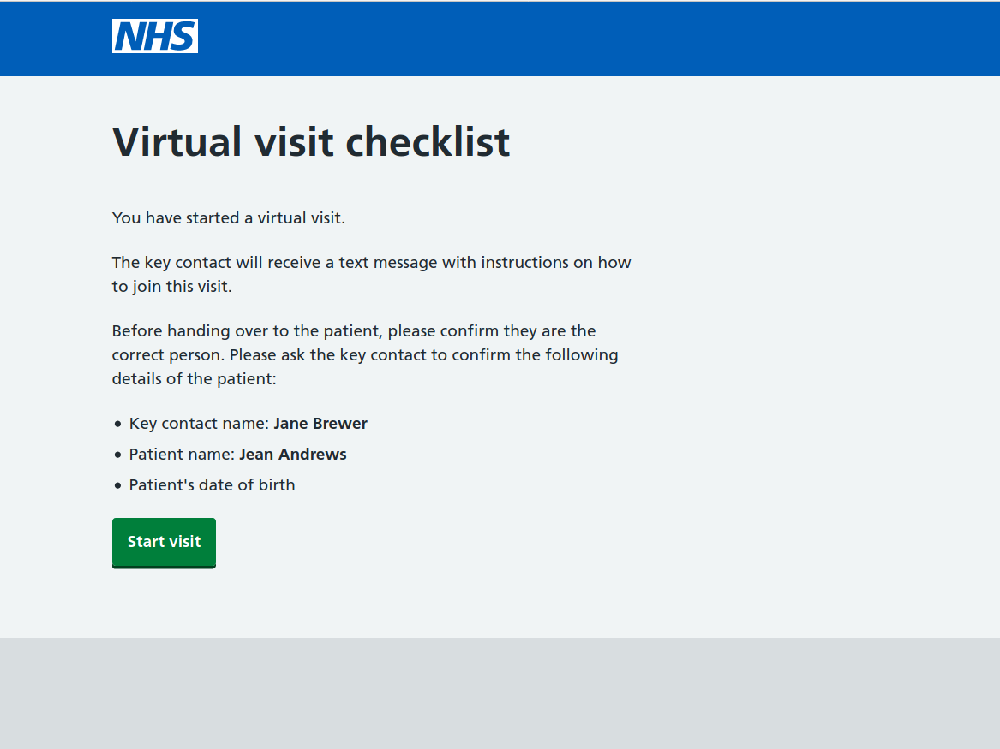
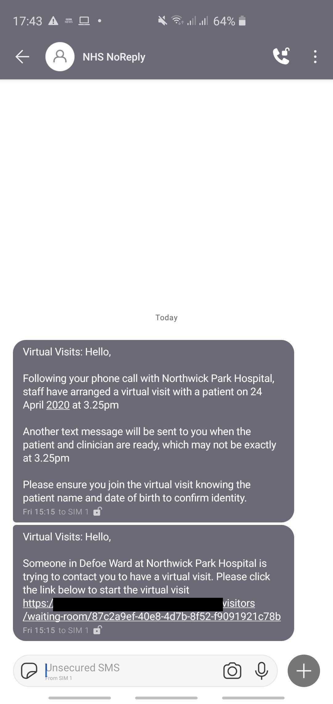
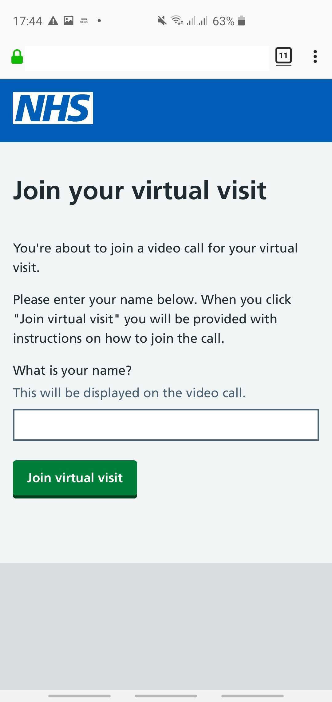

# NHS Virtual Visit

This service allows ward staff to schedule a visit for a patient. Allowing face to face visits for visitors who are unable to visit in person.

## User flows

### Scheduling a visit

1. Ward staff makes contact with a visitor of a patient
2. A date and time is agreed and the ward staff schedules the visit
3. The visitor is sent an SMS notification confirming the date and time of the visit

### Starting a visit

1. Ward staff can see a list of visits booked for patients on their ward
1. At the time of a visit, the ward staff will see a reminder of the visit details
1. The ward staff prepares the patient to start the visit
1. An SMS notification with a unique link is sent to the visitor to join the visit
1. The ward staff waits for the visitor to join, and checks some basic details before handing over to the patient

### Joining a visit

1. The visitor will receive an SMS with a unique link
1. Following the link will prompt the visitor to enter their name
1. The visitor confirms the information of the patient with the ward staff
1. The visitor can now communicate face to face through the service with the patient

## Previews

| Ward Staff see list of visits                                            | Ward Staff start a visits                                           |
| ------------------------------------------------------------------------ | ------------------------------------------------------------------- |
|  |  |

| Visitor receives SMS notifications                                 | Visitor joins a visit                                         | Visitor ends a visit                                       |
| ------------------------------------------------------------------ | ------------------------------------------------------------- | ---------------------------------------------------------- |
|  |  |  |

## Technology

The service is currently hosted on [Heroku](https://www.heroku.com), and connects to a [postgres](https://www.postgresql.org) database also hosted on Heroku.

For the SMS messaging it uses [GovNotify](https://www.notifications.service.gov.uk/accounts). This is a secure service that allows the service to communicate clearly with Visitors, building trust that the application is legitimate.

The following video chat capabilities are currently supported:

- [Whereby](https://whereby.com/information/product-api/)
- [Jitsi Meet](https://github.com/jitsi/jitsi-meet/blob/master/doc/README.md)

## Development

Requirements:

- PostgreSQL 12
- Node LTS
- GovNotify API keys

## Environment Setup

### `.env`

In order to run this app locally you will need to add these variables to your `.env` file.

```bash
# GovNotify API Key
API_KEY=
# Postgres Connection String
DATABASE_URL=
URI=
# App hostname
ORIGIN=
# GovNotify Initial Template ID
SMS_INITIAL_TEMPLATE_ID=
TEMPLATE_ID=
# GovNotify Join Template ID
SMS_JOIN_TEMPLATE_ID=
# Valid Ward Codes
ALLOWED_CODES=
# Signing key for JWT tokens
JWT_SIGNING_KEY=
# Whereby Feature Flag
ENABLE_WHEREBY=
# Whereby API Credentials
WHEREBY_API_KEY=
WHEREBY_SUBDOMAIN=
```

### PostgreSQL 12

#### Enable SSL in Postgres

You may need to enable SSL on your local postgres server.

Within the data folder of your PostgreSQL installation (e.g. `~/Library/Application Support/Postgres/var-12`), generate an self-signed certificate (details here https://www.postgresql.org/docs/12/ssl-tcp.html#SSL-CERTIFICATE-CREATION).

After generating the certificate, edit the postgresql.conf file in the data folder to enable ssl (`ssl = on`).

Restart your PostgreSQL server and SSL will connections will be enabled

#### Setup the database

1. Create the database
   ```bash
   createdb nhs-virtual-visit-dev
   ```
1. Load the current schema into the database
   ```bash
   cat db/schema.sql | psql nhs-virtual-visit-dev
   ```
1. Add the database URI as an environment variable in `.env`. On Linux you may need to provide a username and password.
   ```bash
   cat <<<EOF > .env
   DATABASE_URI=postgresql://localhost/nhs-virtual-visit-dev
   URI=postgresql://localhost/nhs-virtual-visit-dev
   EOF
   ```

## Running the service locally

You can run a local copy of the app by running

```bash
npm install
npm run dev
```

Open [http://localhost:3000](http://localhost:3000) with your browser to see the result.

## Running tests

You can run tests by running

```bash
npm run test
```

## Building a production version

```bash
npm run build
```

This will produce output that you can use to host a production copy of the app.

## Scheduling regular database cleanup

Old scheduled calls are deleted after 24 hours. You can cleanup the table by running the following in a scheduled job runner of your choosing (for Heroku we use https://devcenter.heroku.com/articles/scheduler)

```bash
npm run cleandb
```

## More documentation

- [Glossary](docs/GLOSSARY.md) - types of users, vocabulary used in copy and descriptions of the intent for each page.

## Contributors

- **Luke Morton** - CTO at [Made Tech](https://www.madetech.com) (luke@madetech.com)
- **Jessica Nichols** - Delivery Manager at [Made Tech](https://www.madetech.com) (jessica.nichols@madetech.com)
- **Antony O'Neill** - Lead Software Engineer at [Made Tech](https://www.madetech.com) (antony.oneill@madetech.com)
- **Tom Davies** - Senior Software Engineer at [Made Tech](https://www.madetech.com) (tom.davies@madetech.com)
- **Jiv Dhaliwal** - Senior Software Engineer at [Made Tech](https://www.madetech.com) (jiv.dhaliwal@madetech.com)
- **Daniel Burnley** - Senior Software Engineer at [Made Tech](https://www.madetech.com) (dan@madetech.com)
- **Steve Knight** - Senior Software Engineer at [Made Tech](https://www.madetech.com) (steve.knight@madetech.com)
- **George Schena** - Software Engineer at [Made Tech](https://www.madetech.com) (george@madetech.com)
- **Wen Ting Wang** - Software Engineer at [Made Tech](https://www.madetech.com) (wenting@madetech.com)
- **Joshua-Luke Bevan** - Software Engineer at [Made Tech](https://www.madetech.com) (joshua.bevan@madetech.com)

## License

[MIT](LICENSE)
