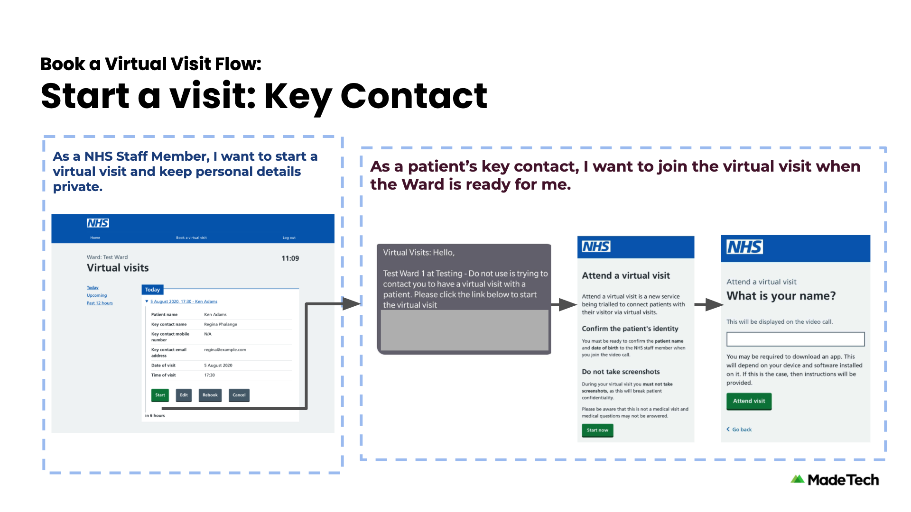
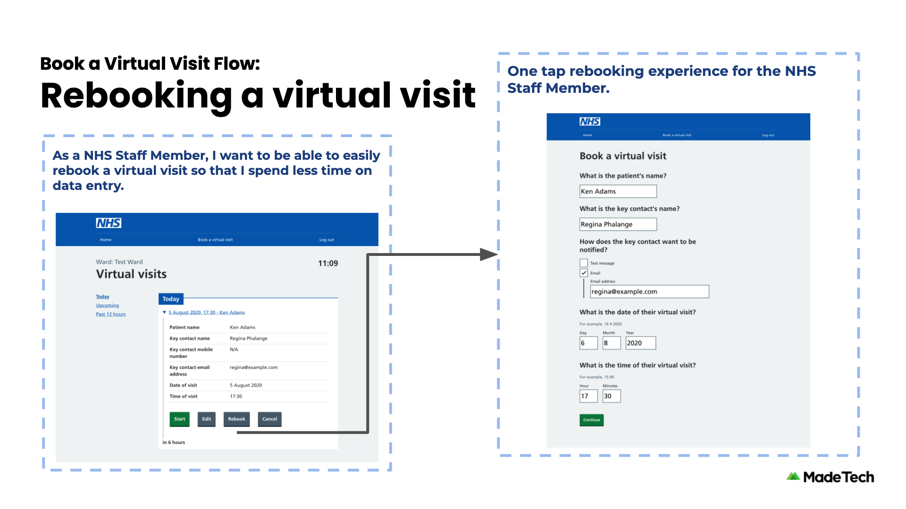

# NHS Virtual Visit

This service allows ward staff to schedule a visit for a patient. Allowing face to face visits for visitors who are unable to visit in person.

It includes an administration panel which provides self-service functionality for adding new Trusts, Hospitals, and Wards.

## User flows

### Scheduling a visit

1. Ward staff makes contact with a visitor of a patient
1. A date and time is agreed and the ward staff schedules the visit
1. The visitor is sent an SMS or email notification confirming the date and time of the visit

### Starting a visit

1. Ward staff can see a list of visits booked for patients on their ward
1. At the time of a visit, the ward staff will see a reminder of the visit details
1. The ward staff prepares the patient to start the visit
1. An SMS or email notification with a unique link is sent to the visitor to join the visit
1. The ward staff waits for the visitor to join, and checks some basic details before handing over to the patient

### Joining a visit

1. The visitor will receive an SMS or email with a unique link
1. Following the link will prompt the visitor to enter their name
1. The visitor confirms the information of the patient with the ward staff
1. The visitor can now communicate face to face through the service with the patient

## Previews

<!-- To update the screenshots, please see the overview slide deck https://docs.google.com/presentation/d/1KaHYSZzcdFJ1oOCZdiPfZCXv9uAEOeE8EvkIjD-mId8/edit -->

|             |  |
| ----------------------------------------------------------------------------------------------- | ---------------------------------------------------------------------------------------------------- |
|  |                      |
|                 |     |

## Technology

The service is currently hosted on [Heroku](https://www.heroku.com), and connects to a [postgres](https://www.postgresql.org) database also hosted on Heroku.

For the SMS messaging it uses [GovNotify](https://www.notifications.service.gov.uk/accounts). This is a secure service that allows the service to communicate clearly with Visitors, building trust that the application is legitimate.

The following video chat capabilities are currently supported:

- [Whereby](https://whereby.com/information/product-api/)
- [Jitsi Meet](https://github.com/jitsi/jitsi-meet/blob/master/doc/README.md)

## Development

Please read our separate [Development Guide](./docs/development/README.md).

## Contributing

Please take a look at our separate [Contributing Guide](./CONTRIBUTING.md).

## More documentation

- [Glossary](docs/GLOSSARY.md) - types of users, vocabulary used in copy and descriptions of the intent for each page.

## Contributors

- **Luke Morton** - CTO at [Made Tech](https://www.madetech.com) (luke@madetech.com)
- **Jessica Nichols** - Delivery Manager at [Made Tech](https://www.madetech.com) (jessica.nichols@madetech.com)
- **Antony O'Neill** - Lead Software Engineer at [Made Tech](https://www.madetech.com) (antony.oneill@madetech.com)
- **Tom Davies** - Senior Software Engineer at [Made Tech](https://www.madetech.com) (tom.davies@madetech.com)
- **Jiv Dhaliwal** - Senior Software Engineer at [Made Tech](https://www.madetech.com) (jiv.dhaliwal@madetech.com)
- **Daniel Burnley** - Senior Software Engineer at [Made Tech](https://www.madetech.com) (dan@madetech.com)
- **Steve Knight** - Senior Software Engineer at [Made Tech](https://www.madetech.com) (steve.knight@madetech.com)
- **George Schena** - Software Engineer at [Made Tech](https://www.madetech.com) (george@madetech.com)
- **Wen Ting Wang** - Software Engineer at [Made Tech](https://www.madetech.com) (wenting@madetech.com)
- **Joshua-Luke Bevan** - Software Engineer at [Made Tech](https://www.madetech.com) (joshua.bevan@madetech.com)
- **Stephen Thomson** - Senior Software Engineer at [Made Tech](https://www.madetech.com) (stephen.thomson@madetech.com)
- **Neil Kidd** - Lead Software Engineer at [Made Tech](https://www.madetech.com) (neil.kidd@madetech.com)
- **Stu Mackellar** - Lead Software Engineer at [Made Tech](https://www.madetech.com) (stu.mackellar@madetech.com)
- **Robert Marshall** - Senior Software Engineer at [Made Tech](https://www.madetech.com) (robert.marshall@madetech.com)

## License

[MIT](LICENSE)
