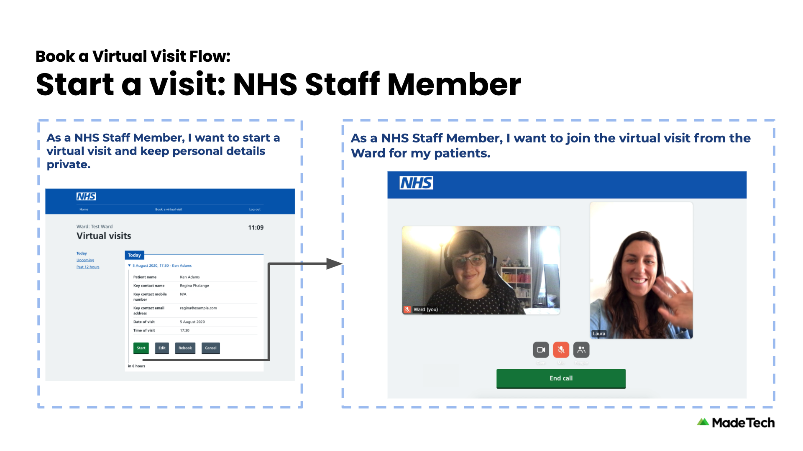

# NHS Virtual Visit

This service allows ward staff to schedule a visit for a patient. Allowing face to face visits for visitors who are unable to visit in person.

It includes an administration panel which provides self-service functionality for adding new Trusts, Hospitals, and Wards.

## User flows

### Scheduling a visit

1. Ward staff makes contact with a visitor of a patient
2. A date and time is agreed and the ward staff schedules the visit
3. The visitor is sent an SMS or email notification confirming the date and time of the visit

### Starting a visit

1. Ward staff can see a list of visits booked for patients on their ward
1. At the time of a visit, the ward staff will see a reminder of the visit details
1. The ward staff prepares the patient to start the visit
1. An SMS or email notification with a unique link is sent to the visitor to join the visit
1. The ward staff waits for the visitor to join, and checks some basic details before handing over to the patient

### Joining a visit

1. The visitor will receive an SMS or email with a unique link
1. Following the link will prompt the visitor to enter their name
1. The visitor confirms the information of the patient with the ward staff
1. The visitor can now communicate face to face through the service with the patient

## Previews

|             |  |
| ----------------------------------------------------------------------------------------------- | ---------------------------------------------------------------------------------------------------- |
|  |                      |
|                 |     |

## Technology

The service is currently hosted on [Heroku](https://www.heroku.com), and connects to a [postgres](https://www.postgresql.org) database also hosted on Heroku.

For the SMS messaging it uses [GovNotify](https://www.notifications.service.gov.uk/accounts). This is a secure service that allows the service to communicate clearly with Visitors, building trust that the application is legitimate.

The following video chat capabilities are currently supported:

- [Whereby](https://whereby.com/information/product-api/)
- [Jitsi Meet](https://github.com/jitsi/jitsi-meet/blob/master/doc/README.md)

## Development

Requirements:

- PostgreSQL 12
- Node LTS (Currently Node 12. There is a known issue with db-migrate and Node 14)
- GovNotify API keys

## Environment Setup

### `.env`

In order to run this app locally you will need to create a `.env` file in the root of this project and add these variables to it.

```bash
# GovNotify API Key
API_KEY=
# Postgres Connection String
DATABASE_URL=
# Postgres Connection String for the test database
TEST_DATABASE_URL=
# GovNotify SMS Initial Template ID
SMS_INITIAL_TEMPLATE_ID=
# GovNotify SMS Join Template ID
SMS_JOIN_TEMPLATE_ID=
# GovNotify Email Initial Template ID
EMAIL_INITIAL_TEMPLATE_ID=
# GovNotify Email Join Template ID
EMAIL_JOIN_TEMPLATE_ID=
# Valid Ward Codes
ALLOWED_CODES=
# Signing key for JWT tokens
JWT_SIGNING_KEY=
# Whereby Feature Flag
ENABLE_WHEREBY=
# Whereby API Credentials
WHEREBY_API_KEY=
WHEREBY_SUBDOMAIN=
# Sentry credentials
SENTRY_DSN=
SENTRY_ORG=
SENTRY_PROJECT=
SENTRY_AUTH_TOKEN=
ENABLE_SENTRY=
```

### PostgreSQL 12

If you are installing a local instance of PostgreSQL on Ubuntu, see the steps in the separate [guide.](UBUNTU2004-PG12.md)

#### Enable SSL in Postgres

You may need to enable SSL on your local postgres server.

Within the data folder of your PostgreSQL installation (e.g. `~/Library/Application Support/Postgres/var-12` or `/usr/local/var/postgres`), generate an self-signed certificate (details here https://www.postgresql.org/docs/12/ssl-tcp.html#SSL-CERTIFICATE-CREATION).

After generating the certificate, edit the postgresql.conf file in the data folder to enable ssl (`ssl = on`).

Restart your PostgreSQL server and SSL will connections will be enabled

#### Setup the database

1. Create the database
   ```bash
   createdb nhs-virtual-visit-dev
   ```
2. Run all migrations
   ```bash
   npm run dbmigrate up
   ```
3. Add the database URL as an environment variable in `.env`. On Linux you may need to provide a username and password.
   ```bash
   cat <<<EOF >> .env
   DATABASE_URL=postgresql://localhost/nhs-virtual-visit-dev
   EOF
   ```

#### Seeding the database

To seed your database with data to get going quickly, you can run the file under `db/seeds.sql` by doing the following:

```bash
cat db/seeds.sql | psql nhs-virtual-visit-dev
```

This will create two wards with codes `TEST1` and `TEST2`

## Running the service locally

You can run a local copy of the app by running

```bash
npm install
npm run dev
```

Open [http://localhost:3000](http://localhost:3000) with your browser to see the result.

## Running tests

You can run tests by running

```bash
npm run test
```

Contract tests can be run with

```bash
npm run test:contract
```

Note: A test database is required to run contract tests. You can quickly set one up using `bin/setup_test_db.sh`

## Building a production version

```bash
npm run build
```

This will produce output that you can use to host a production copy of the app.

## Scheduling regular database cleanup

Old scheduled calls are deleted after 24 hours. You can cleanup the table by running the following in a scheduled job runner of your choosing (for Heroku we use https://devcenter.heroku.com/articles/scheduler)

```bash
npm run cleandb
```

## Applying database migrations

Database migrations are managed with [db-migrate](https://github.com/db-migrate/node-db-migrate). To create a new migration

```bash
npm run dbmigrate create description-for-your-migration
```

This will create an up and down migration as sql files in `db/migrations/sqls` as well as a javascript file in `db/migrations` to run the sql files.

Migrations are run with

```bash
npm run dbmigrate up
```

Migrations can be rolled back with

```bash
npm run dbmigrate down
```

You can do a dry-run to view the changes that will be applied without making any changes (for both up and down migrations)

```bash
npm run dbmigratedry up
```

To update the `db/schema.sql` file:

```bash
pg_dump -d nhs-virtual-visit-dev -s > db/schema.sql
```

## More documentation

- [Glossary](docs/GLOSSARY.md) - types of users, vocabulary used in copy and descriptions of the intent for each page.

## Contributors

- **Luke Morton** - CTO at [Made Tech](https://www.madetech.com) (luke@madetech.com)
- **Jessica Nichols** - Delivery Manager at [Made Tech](https://www.madetech.com) (jessica.nichols@madetech.com)
- **Antony O'Neill** - Lead Software Engineer at [Made Tech](https://www.madetech.com) (antony.oneill@madetech.com)
- **Tom Davies** - Senior Software Engineer at [Made Tech](https://www.madetech.com) (tom.davies@madetech.com)
- **Jiv Dhaliwal** - Senior Software Engineer at [Made Tech](https://www.madetech.com) (jiv.dhaliwal@madetech.com)
- **Daniel Burnley** - Senior Software Engineer at [Made Tech](https://www.madetech.com) (dan@madetech.com)
- **Steve Knight** - Senior Software Engineer at [Made Tech](https://www.madetech.com) (steve.knight@madetech.com)
- **George Schena** - Software Engineer at [Made Tech](https://www.madetech.com) (george@madetech.com)
- **Wen Ting Wang** - Software Engineer at [Made Tech](https://www.madetech.com) (wenting@madetech.com)
- **Joshua-Luke Bevan** - Software Engineer at [Made Tech](https://www.madetech.com) (joshua.bevan@madetech.com)
- **Stephen Thomson** - Senior Software Engineer at [Made Tech](https://www.madetech.com) (stephen.thomson@madetech.com)
- **Neil Kidd** - Lead Software Engineer at [Made Tech](https://www.madetech.com) (neil.kidd@madetech.com)

## License

[MIT](LICENSE)
