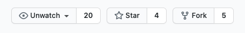

# 1. Setting up your repository

Current NHS trusts have forked the `made-tech/nhs-virtual-visit` repository so
that they can develop their own features whilst receiving updates from Made
Tech.

## Forking the repository

1. Navigate to the [NHS Book a virtual visit repository](https://github.com/madetech/nhs-virtual-visit)
2. In the top-right corner of the page, click **Fork**

## Keeping in sync with the upstream repository

As time goes on, your trust fork will become out of date with the upstream as we
deliver security patches, and possibly new features. You can either install a
utility to keep your fork up to date automatically, or manually sync the fork
yourself.

### Automatically updating your fork

We have set up the repository to work instantly with the [Pull app by Wei](https://github.com/wei/pull). To install the app, visit [github.com/apps/pull](https://github.com/apps/pull) and click install, pointing the app to your newly created fork.

### Manually updating your fork

You can also manually sync your fork with the upstream repo via the following
instructions: [Github: Syncing a fork](https://docs.github.com/en/github/collaborating-with-issues-and-pull-requests/syncing-a-fork).

### Caveats

If you make changes to your forked repo, the Pull utility (or manual sync) will attempt to merge our changes into yours. Any conflicting changes will need to be resolved (see [Github: Addressing merge conflicts](https://docs.github.com/en/github/collaborating-with-issues-and-pull-requests/addressing-merge-conflicts)).
